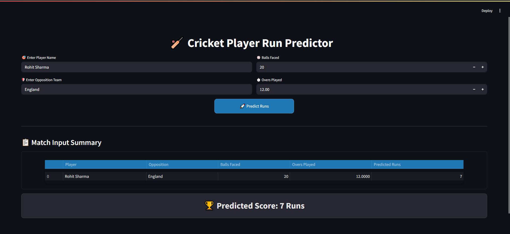

# Cricket Player Run Predictor 🏏

A machine learning-powered web application that predicts cricket player runs based on historical performance data. Built with Streamlit and Scikit-learn, this tool provides accurate run forecasts for players against specific opposition teams.



## Features

- **Intuitive Interface**: User-friendly input fields for player name, opposition team, balls faced, and overs played
- **Smart Validation**: Input validation with helpful error messages and same-country matchup prevention
- **Visual Feedback**: Engaging Lottie animations during prediction processing
- **Responsive Design**: Clean, modern UI with cricket-themed styling
- **Data-Driven Predictions**: Decision Tree Regressor model trained on historical player performance data

## Installation

1. Clone the repository:
```bash
git clone https://github.com/your-username/cricket-player-predictor.git
cd cricket-player-predictor
```

2. Install required dependencies:
```bash
pip install -r requirements.txt
```

3. Place your dataset file (`newplayer.csv`) in the project directory

## Usage

1. Run the application:
```bash
streamlit run app.py
```

2. Open your browser and navigate to the local URL provided (typically http://localhost:8501)

3. Enter the required information:
   - Player name
   - Opposition team
   - Balls faced
   - Overs played

4. Click the "Predict Runs" button to see the forecasted score

## Dataset Requirements

The application expects a CSV file with the following columns:
- Player: Player name
- Opposition: Team played against (without 'v ' prefix)
- Overs: Overs played (minimum 5.0)
- BF: Balls faced
- Runs: Runs scored
- Team Runs: Team total runs (formatted with '/' or '.')

## Technologies Used

- **Python**: Core programming language
- **Streamlit**: Web application framework
- **Pandas**: Data manipulation and analysis
- **Scikit-learn**: Machine learning library (Decision Tree Regressor)
- **Lottie**: Animation rendering

## File Structure

```
cricket-player-predictor/
├── app.py                 # Main application file
├── newplayer.csv          # Dataset file (not included in repo)
├── Animation.json         # Lottie animation file
├── images/                # Folder for screenshots
│   └── app.png            # Application screenshot
├── requirements.txt       # Python dependencies
└── README.md              # Project documentation
```

## Contributing

Contributions are welcome! Please feel free to submit a Pull Request.

## License

This project is open source and available under the (LICENSE).

## Acknowledgments

- Cricket data sourced from public historical records
- Lottie animations from LottieFiles
- Streamlit community for the excellent web framework

---

For questions or support, please open an issue in the GitHub repository.
